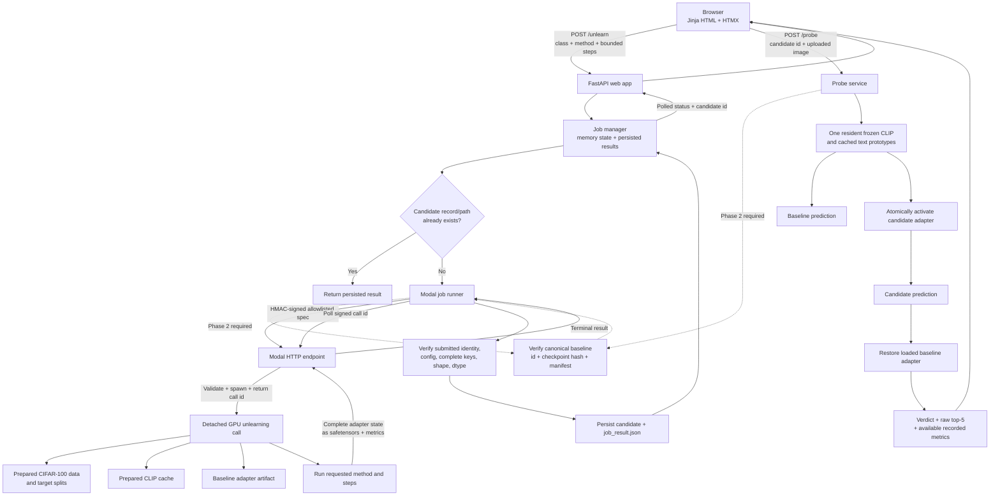

# Interface and Remote Job Flow

Solid nodes describe the current FastAPI/Modal job and probe architecture.
The canonical manifest gate is required by PLAN Phase 2 and is not yet
implemented end to end. Until that gate exists, the current worker can still
discover a legacy baseline by directory pattern.

Clipboard paste is planned for Phase 5. It must feed the same bounded image
validation path as the existing upload route; it does not create a second
probe backend.

In the legacy flow, a matching path is not proof of baseline compatibility.
Until manifest enforcement is implemented, operators must explicitly align the
interface baseline checkpoint with the worker's uploaded checkpoint.
